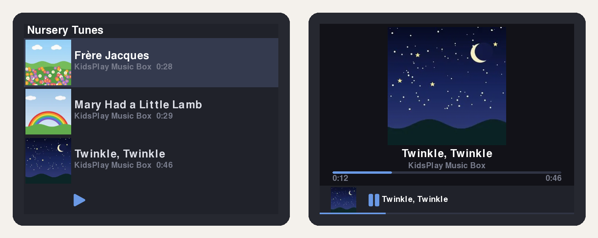
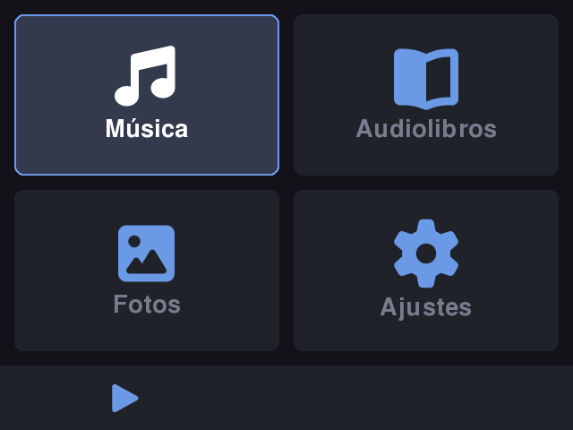
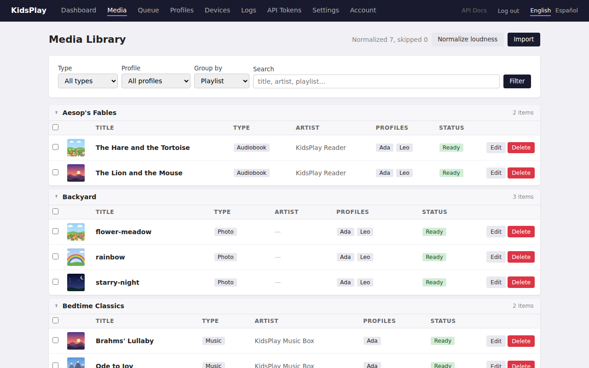
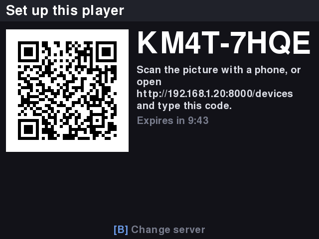

# KidsPlay

Music, audiobooks and photos for kids, on a handheld that works offline.



A parent manages the media from a web UI (or CLI). The server does all the
processing (transcoding, thumbnails, resizing) and each child's device syncs
its own library whenever it can reach the server. After a sync, the device
plays everything with no network at all.

The reference device is a Raspberry Pi CM4 in a Retroflag GPi Case 2
(640×480 screen, game-controller buttons), but the player is a plain
pygame-ce app and runs on any Linux box or desktop.

> **Status:** early and opinionated. It runs one family's devices every day,
> and is being generalized for other people's setups. Expect rough edges.

## Disclaimer

This software was completely generated using Claude Code. I provided design guidance and
the set of requirements. It grew out of an older version I co-developed with a much less
capable Claude.

My kids use it almost daily and love it. :-)

## Try it in 2 minutes

You need [uv](https://docs.astral.sh/uv/) and `ffmpeg`. On a Mac or Linux box:

```bash
git clone https://github.com/anthonytw/kidsplay.git
cd kidsplay
just demo    # no just? `uvx --from rust-just just demo` works with only uv
```

This starts a server with a temporary data directory, imports a small set of
bundled sample music, audiobooks and photos (all CC0, see
[THIRD_PARTY_NOTICES.md](THIRD_PARTY_NOTICES.md)), creates two profiles (Ada
and Leo) and registers a handheld for Ada, then opens the player in a window.
The web UI's address is printed in the terminal.

The keyboard stands in for the handheld's buttons: arrows move, Enter selects,
Backspace goes back, Space plays or pauses, Esc quits. Closing the player stops
the server and deletes the temporary data (`just demo --keep` keeps it, and
`just demo --no-player` runs only the server and web UI).

| On the handheld | In the web UI |
|---|---|
|  |  |

## Components

| Package | Description | Runs on |
|---------|-------------|---------|
| **kidsplay-models** | Shared Pydantic data models (the API contract) | Everywhere |
| **kidsplay-server** | FastAPI server: media ingest, processing, storage, sync, web UI | A home server / NAS |
| **kidsplay-cli** | Terminal client for the server's API | Any machine |
| **kidsplay-device** | pygame-ce player with background sync | The handheld |

## Running the server

With Docker:

```bash
docker compose -f docker/docker-compose.yml up -d --build
# web UI at http://<host>:8000/
```

Data lands in `docker/data/` by default; see `docker/.env.example` to change
paths and the port.

Or directly with [uv](https://docs.astral.sh/uv/) (needs `ffmpeg` on `PATH`):

```bash
uv sync --all-packages
uv run uvicorn kidsplay_server.api.app:create_app_from_env --factory --no-proxy-headers --host 0.0.0.0 --port 8000
```

`--no-proxy-headers` stops uvicorn believing `X-Forwarded-*` on its own; behind
a reverse proxy, name it in `KIDSPLAY_TRUSTED_PROXIES` instead (see
[docs/DEVELOPMENT.md](docs/DEVELOPMENT.md#behind-a-reverse-proxy)).

On first visit the web UI asks you to choose an admin password; after that it
shows a login page. So that nobody else on the network can claim the account
first, the server prints a one-time **setup code** in its log when it starts
(`docker compose logs kidsplay-server` with Docker), and the setup page asks for
it. Headless installs can skip that by pre-seeding the password with
`KIDSPLAY_ADMIN_PASSWORD`. Device sync is authenticated per device by API key
and needs no admin login. See [docs/DEVELOPMENT.md](docs/DEVELOPMENT.md#authentication)
for the auth settings, including `KIDSPLAY_AUTH=disabled` for installs that
already sit behind an authenticating proxy.

Songs and audiobooks are loudness-normalized in the background after ingest
(EBU R128, -16 LUFS by default), so every track plays at about the same volume;
an upload returns as soon as the file is stored. Bring an existing
library to the target with `kidsplay media normalize --all`; see
[docs/LOUDNESS.md](docs/LOUDNESS.md) for settings and the cost on a Pi.

Back up the server (database, device keys and media store) with
`kidsplay-server backup`. It is safe while the server runs and incremental into
a directory. See [docs/BACKUP.md](docs/BACKUP.md) for scheduling, Docker usage
and restoring.

## Setting up a device

On the handheld, from a checkout, run **one command**. It will not finish
unless you pick one of two modes:

```bash
git clone https://github.com/anthonytw/kidsplay ~/kidsplay && cd ~/kidsplay

# A. Connect to your KidsPlay server (recommended)
packages/kidsplay-device/deploy/install-device.sh \
  --server https://kidsplay.example.net --timezone America/New_York

# B. No server? Run the server and the player on this one device
packages/kidsplay-device/deploy/install-device.sh \
  --standalone --profile-name "Alice" --timezone America/New_York
sudo reboot
```

- **`--server URL`** presets the server the device pairs with, so nobody types
  an address on a D-pad keyboard. After the reboot the handheld shows a pairing
  code and a QR code; scan it with a phone (or open **Devices** in the web UI),
  pick the child's profile and approve. Codes last 10 minutes and work once.
  Add `--config FILE` (from `kidsplay device setup --output FILE`) to install a
  ready-made config instead of pairing. See [docs/PAIRING.md](docs/PAIRING.md).
- **`--standalone`** installs the server and the player together
  (`kidsplay-allinone`, which asks for an admin password or reads
  `KIDSPLAY_ADMIN_PASSWORD`); files are hard-linked instead of stored twice.
  Options: `--lan`, `--port`, `--device-name`. See
  [docs/ALL_IN_ONE.md](docs/ALL_IN_ONE.md).

Both set up the console-boot kiosk
([packages/kidsplay-device/deploy/README.md](packages/kidsplay-device/deploy/README.md)).
`--timezone` matters: bedtime is enforced in the device's local time. Run it
with no mode for the usage text. An existing config for a different server is
never replaced without `--force`.



### Alternative: pair on the device

Install and start the player by hand on a handheld that has no
`~/.kidsplay/config.json` (`uv sync --package kidsplay-device`, then
`uv run kidsplay-player`; `--package` is required, a bare `uv sync` skips the
player). If the server advertises itself the handheld offers it; otherwise type
its address on the on-screen keyboard.

### Alternative: set up from the command line

Scripts, or a device you cannot see, can still get a `~/.kidsplay/config.json`
generated by the server. Run this from any machine that can reach the server:

```bash
export KIDSPLAY_SERVER=http://kidsplay.local:8000

# 0. Log in once (prompts for the admin password, saves a token)
uv run kidsplay auth login

# 1. Create a profile for the child (note the UUID it prints)
uv run kidsplay profile create "Alice"

# 2. Register the device and write its config
uv run kidsplay device setup --name "Alice's handheld" --profile <profile-uuid> \
  --output config.json

# 3. Copy it to the device
scp config.json pi@alice-pi.local:~/.kidsplay/config.json
```

Omitting `--output` prints the JSON instead, so you can pipe it over SSH:

```bash
uv run kidsplay device setup --name "Bob's handheld" --profile <profile-uuid> | \
  ssh pi@bob-pi.local "mkdir -p ~/.kidsplay && cat > ~/.kidsplay/config.json"
```

Then give it the config: `install-device.sh --server URL --config config.json`
on the device does it safely (mode 600, nothing to pair), or copy the file as
above and start the player (`uv run kidsplay-player`).

### Re-creating a lost config

If a device is already registered (e.g. after re-flashing its OS), look up its
ID with `kidsplay device list`, get the API key from your records, and run:

```bash
uv run kidsplay device setup --device-id <device-uuid> --api-key <api-key> \
  --output ~/.kidsplay/config.json
```

### Config options

| Flag | Default | Description |
|------|---------|-------------|
| `--media-root` | `~/.kidsplay/media` | Where synced files are stored on the device |
| `--db-path` | `~/.kidsplay/db.sqlite` | Local SQLite database path |
| `--sync-interval` | `900` | Seconds between background syncs |
| `--width` / `--height` | `640` / `480` | Screen resolution; registered for a new device and written to the config when not 640×480 (see [docs/HARDWARE.md](docs/HARDWARE.md)) |
| `--output` / `-o` | _(stdout)_ | Write JSON to a file instead of printing |

## Development

```bash
uv sync --all-packages
uv run pytest
uv run ruff check . --fix && uv run ruff format .
uv run ty check
```

- [CLAUDE.md](CLAUDE.md): conventions, architecture principles and the tech
  stack (written for coding agents, and useful for humans too)
- [docs/ARCHITECTURE.md](docs/ARCHITECTURE.md): system design
- [docs/API.md](docs/API.md): REST endpoint contracts
- [docs/IMPORTERS.md](docs/IMPORTERS.md): media sources and writing an importer plugin
- [docs/DEVELOPMENT.md](docs/DEVELOPMENT.md): local development
- [docs/HARDWARE.md](docs/HARDWARE.md): other screens and controls: resolution, input profiles
- [docs/THEMES.md](docs/THEMES.md): per-profile themes, custom fonts, sounds and backgrounds
- [docs/BACKUP.md](docs/BACKUP.md): server backup and restore
- [docs/TRANSLATING.md](docs/TRANSLATING.md): languages and how to add one
- [docs/RELEASE_CHECKLIST.md](docs/RELEASE_CHECKLIST.md): the manual checks run on a real handheld before each release
- [CONTRIBUTING.md](CONTRIBUTING.md): checks, workflow and commit conventions

## A note on YouTube imports

The server can import audio from YouTube URLs using
[yt-dlp](https://github.com/yt-dlp/yt-dlp), through the optional
`kidsplay-importer-ytdlp` plugin. The Docker image includes it by default; see
[docs/IMPORTERS.md](docs/IMPORTERS.md) to leave it out or to write an importer
for another source. Only import content you have the right to download, and
check the terms of the site you are downloading from. The importer extracts only
the thumbnail and audio. Playlists are supported as well, there is a built-in
queuing system.

## License

[GNU AGPL-3.0-or-later](LICENSE). If you run a modified KidsPlay server for
other people, the AGPL asks you to offer them its source: the web UI's footer
links to it, so set `KIDSPLAY_SOURCE_URL` to your repository (see
[docs/DEVELOPMENT.md](docs/DEVELOPMENT.md)). Vendored third-party files keep
their own licenses, listed in [THIRD_PARTY_NOTICES.md](THIRD_PARTY_NOTICES.md).
