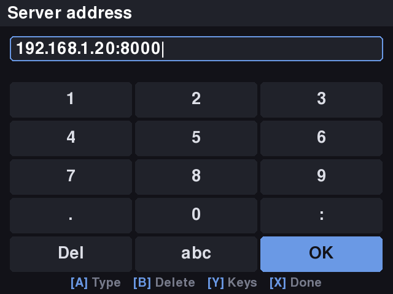

# Pairing a handheld

A handheld with no `config.json` pairs itself with the server: it shows a code
and a QR code, a parent approves it on the web UI, and the device writes its
own `config.json` and starts syncing. No `kidsplay device setup`, no `scp`.

`kidsplay device setup` still works (and is what scripts should use);
pairing writes the same file. A device that already has a `config.json`, and
every all-in-one install (`kidsplay-allinone` writes the config itself), never
shows the pairing screen.

## Presetting the server (no typing on the device)

A handheld has no keyboard, so typing a server address means one D-pad press
per character. Instead, tell the device which server to pair with, and it
shows its pairing code immediately; the parent only approves it.

The easiest way is the installer, which does it for you:

```bash
packages/kidsplay-device/deploy/install-device.sh --server https://kidsplay.example.net
```

(`install-kiosk.sh --server URL` does the same preset on its own.) The
address is checked with the player's own parser first, then written to
`~/.kidsplay/pair-server.txt`. Two other places are read too, in this order:

1. `kidsplay-player --pair-server URL` on the command line;
2. `~/.kidsplay/pair-server.txt`, next to `config.json`;
3. `/boot/firmware/kidsplay-server.txt` on the SD card's boot partition. Any
   computer can write it after flashing the card, before the device ever boots:
   put the address on the first line (blank lines and `#` comments are
   skipped).

A preset is used only while there is no `config.json`, so it never overrides a
paired device. **B** on the pairing screen still goes back to the server
picker, where the preset is the first row ("Preset: <address>"): **A** on it
starts pairing again with a fresh code. An unusable preset is logged and ignored. If you already have a
config for another server, `install-device.sh` refuses to replace it unless
you pass `--force`.

## Pairing a device

1. Install the player on the handheld with
   `packages/kidsplay-device/deploy/install-device.sh --server URL`
   ([above](#presetting-the-server-no-typing-on-the-device); or
   [DEVELOPMENT.md](DEVELOPMENT.md)) and start it with no
   `~/.kidsplay/config.json`.
2. **Pick the server.** With a preset there is nothing to pick: go to step 3.
   Otherwise, if the server advertises itself (see
   [Finding the server](#finding-the-server)) the device lists it as
   "KidsPlay · 192.168.1.20:8000 · 3F2A-9C1E" (name, address and the server's
   ID); choose it only if you recognize it, because anyone on the network can
   announce a server. Otherwise choose "Type the address…"
   and use the on-screen keyboard: D-pad to move, **A** types the highlighted
   key, **B** deletes (and goes back when there is nothing left), **Y**
   switches between the numeric and letter keys, **X** or the OK key confirms.
   An address without a port gets `:8000`. (`kidsplay-player` uses these
   buttons on a gamepad; on a keyboard they are Enter/A, B/Backspace, Y and X.)
3. The device shows a code such as `ABCD-2345`, a QR code, a countdown and the
   server's **ID** (`3F2A-9C1E`). The Devices page shows the same ID as "This
   server's ID"; if they differ, the handheld is talking to a different server:
   don't approve.

   
   

4. On a phone or computer, scan the QR code (it opens the Devices page with the
   code filled in; log in if asked) or open **Devices** and type the code shown
   on the handheld's screen. Scanning also shows the name and screen size the
   device reported, so you can check them. Choose the child's **profile**,
   optionally rename the device, and press **Approve**.
5. Within a few seconds the device says "All set!" and starts syncing.

The Devices page deliberately has no list of waiting requests to click:
anyone on the network can register a request under any name (such as "Leo's
Player"), so you always start from the code on the handheld you are holding.
It shows only how many requests are waiting. **Decline** rejects the code you
have typed.

If something goes wrong the device says so and offers **A** to try again with a
fresh code or **B** to pick another server:

| The device says | Meaning |
|---|---|
| This code has expired. | Nobody approved it within 10 minutes. |
| This code was already used. | The key for this code was already collected. |
| The request was declined. | A parent pressed Decline. |
| Pairing is turned off on the server. | See [Turning pairing off](#turning-pairing-off). |
| The server is busy. Try again in a minute. | Rate limited, or too many requests are waiting. |
| Couldn't reach the server. | Wrong address, server down, or not a KidsPlay server. While a code is showing, a dropped connection is retried (with growing pauses) until the code expires, so this appears only if the network stays down. |
| Couldn't save the settings on this player. | The parent approved, but the handheld could not write `~/.kidsplay/config.json` (full or read-only card) after three tries. Fix the card, then press **A** to pair again; delete the unused device the first attempt created on the Devices page. |
| That isn't the server you chose. Check the address. | The server that answered has a different ID from the one that took the request. |

**A key lost after delivery.** If the response carrying the key is lost (WiFi
drops at the wrong moment) or the write fails, the device just asks again: the
same binding secret gets the same key for **2 minutes** after the first
delivery, or until the device has saved its config and calls
`POST /pairing/confirm`, whichever is first. After that nothing can read the key
through pairing again. If the handheld is switched off mid-pairing it has lost
its binding secret, so the old request cannot be collected: delete that device
on the Devices page and pair again.

## Turning pairing off

**Settings → Allow pairing new devices**, or `PUT /api/v1/server-settings
{"pairing_enabled": false}`, or `KIDSPLAY_PAIRING_ENABLED=false` (the
environment wins and locks the setting). While off, the server refuses to start,
approve or complete a pairing, including one that was already approved but not
collected. It is on by default; turn it off once your handhelds are set up.

## Finding the server

The server advertises `_kidsplay._tcp` over mDNS (zeroconf) when it is started
with `create_app_from_env`, i.e. the way the docs run it:

| Variable | Default | Effect |
|---|---|---|
| `KIDSPLAY_MDNS` | on | `0`, `false`, `off` or `no` switches advertising off. While on, the server announces itself only while **Allow pairing new devices** is on; turning that setting off withdraws the announcement at once, and turning it on starts it again. |
| `KIDSPLAY_MDNS_PORT` | `8000` | The port devices connect to. The server cannot see the port `uvicorn` was started on, or a reverse proxy in front of it. |
| `KIDSPLAY_MDNS_NAME` | `KidsPlay` | Instance name. |

The announcement carries the server's name, address, port and its ID (the `id`
TXT record). Anyone on the network can announce anything, so it is a label, not
a proof: see [Server identity](#server-identity) for what protects a device.

Advertising is best effort: a machine with no usable network interface, or one
that forbids multicast, logs a warning and the server runs normally. The
address is always available by typing it.

The Docker compose file sets `KIDSPLAY_MDNS=0`: on Docker's default bridge
network the container's address is private to the host, and announcing it would
send devices to an address they cannot reach. Use `network_mode: host` (and
remove that line) if you want discovery from a container. mDNS does not cross
routers or VLANs; a device on an isolated network types the address.

## Security

The endpoints a device calls are unauthenticated, because a device with no
credentials is exactly what is being set up. Everything else about them is
built to make that safe.

**What the code is for.** The code only *names* a request, and the parent has to read it
off the handheld itself (typing it, or scanning the QR code) to approve it. It is not what releases the key. The device also makes up a
**binding secret** (32 random bytes, 256 bits) that is sent to the server when
it registers and again with every poll, and that the server keeps only as a
SHA-256 hash. The API key is released to whoever presents that secret, once.
Someone who sees the code (over a shoulder, on the screen) or guesses it gets
nothing.

**Code strength.** 8 characters from a 31-character alphabet without `0 O 1 I L`:
31⁸ = 852,891,037,441 codes, about 39.6 bits, shown as `ABCD-2345`. A code is
live for at most one request at a time, so nobody can take over a code the real
device holds: a second registration of a live code is answered with the same
`201` as a free code but stores nothing, so it neither displaces the real
device nor reveals that the code is live (each such probe still counts against
the prober's wrong-guess budget below).

**The guessing budget.** Limits are per client (the client address, the same
`client_key` the login and setup throttles use; behind a reverse proxy see
[Behind a reverse proxy](DEVELOPMENT.md#behind-a-reverse-proxy)) and are counted *before* any work is done,
like the login fix in #17, even for malformed requests:

| Limit | Per client | Why |
|---|---|---|
| Starting a pairing | 10 per 10 minutes | A device needs one (a few on collisions). |
| Polls | 60 per minute | A device polls every 3 seconds (20 per minute). |
| Polls with an unknown code or wrong secret, plus registrations of a taken code | 10 per 5 minutes, counted before the lookup so concurrent polls cannot exceed it; further polls get 429 even with the right secret | A device never gets these. |
| Requests waiting on the server | 100 in total | Bounds the table. |

Arithmetic: a client can probe at most 10 codes per 10 minutes, so its chance
of hitting one specific live code in a window is 10 / 8.5×10¹¹ ≈ 1.2×10⁻¹¹; a
botnet of 10,000 addresses gets 1.2×10⁻⁷. Hitting a code buys nothing. Getting
a key needs the binding secret too: at most 10 wrong guesses per 5 minutes
against a 2⁻²⁵⁶ chance each.

Behind a reverse proxy every client used to share the proxy's address, so about
ten junk requests could lock every device out of pairing. With
`KIDSPLAY_TRUSTED_PROXIES` set, the client address comes from the proxy's
`X-Forwarded-For` (only when the request really came from a listed proxy), so
each client has its own budget; without it the old behaviour is unchanged.

**Delivery.** The first poll flips the request from *approved* to *delivered*
in a single atomic `UPDATE` and starts a 2-minute window; only a poll that
presents the binding secret gets the key, and it gets the same one again inside
the window (a lost response, a failed write). `POST /pairing/confirm`, sent once
the config is safely on disk, or the end of the window, closes it for good.
A wrong secret is indistinguishable
from an unknown code (`404 PAIRING_NOT_FOUND`, and the hash comparison runs
either way, in constant time with `hmac.compare_digest`). Expired, used,
declined and unapproved requests never carry a key.

**Approval is admin-only.** Listing, approving and declining need an admin
session (with the CSRF token) or an admin API token, like every other management
route. The approve response does not contain the key.

**Nothing sensitive is logged or stored in the clear.** Codes, secrets and keys
never appear in the server's log (a test checks it). The database holds a hash
of the secret, the device's name and screen size, and the remote address.
(`aiosqlite` logs bound SQL parameters at DEBUG, for every query; the server's
logging setup raises it to WARNING.)

**Cleaning up.** Expired requests, and with them the hashes of their secrets,
are removed at startup and then every 10 minutes, not only when the next
pairing happens.

## Server identity

Any host on the LAN can advertise `_kidsplay._tcp`, so a handheld could be
steered to a look-alike server. What the ID does and does not give you:

- **A stable server ID.** Each server has a random ID (stored in its database,
  so backups keep it; a fresh database gets a new one). Pairing tells the device
  the ID (`server_id`), and the manifest response carries it in
  `X-KidsPlay-Server-Id`.
- **A human check.** The handheld shows the short ID (`3F2A-9C1E`) under its
  code and in the server list; the Devices page shows the same ID. A parent who
  sees two different IDs must not approve. A different server that never sees
  the approval just leaves the handheld to time out, and the picker labels let
  a parent choose the right one. This catches pairing with the *wrong* server.
  It does not catch a relay: a man-in-the-middle that forwards the code to the
  real server passes the real ID through unchanged, so both sides see the
  correct ID.
- **Pinning.** The device saves the ID in `config.json` (`server_id`) and
  refuses to sync from a server that answers with another ID or none: before
  anything is stored (no settings, clock, media or deletions), it logs a warning
  and shows "Unknown server. Ask a grown-up." on the home screen. It keeps
  playing what it has. A device without a pinned ID (set up with
  `kidsplay device setup`, or paired before IDs existed) pins the first ID it
  sees and holds later servers to it. To move a device to another server, pair
  it again there.
- **Limits.** The ID is public and travels in the clear, so this is
  trust-on-first-use. The pinned ID plus the picker labels protect against
  pairing with a wrong or look-alike server and against a later server swap
  (another household's, or one that doesn't know the ID). They do **not**
  protect against a man-in-the-middle relay on the first pairing over plain
  HTTP, and they do not authenticate the server against anyone who copies the
  ID. Before any identity check the device sends its API key and binding secret
  in plaintext to whatever answers at `server_url`. What does protect is HTTPS
  with a trusted certificate, for example the server behind a reverse proxy
  (see [Behind a reverse proxy](DEVELOPMENT.md#behind-a-reverse-proxy)): use it
  if the LAN isn't trusted.

**On the device**, `config.json` is created with mode 0600 from the first byte
(never briefly world-readable) and put in place with an atomic rename, with the
same keys as `kidsplay device setup`: `server_url`, `device_id`, `api_key`,
`media_root`, `db_path`, `sync_interval_seconds` (plus `server_id`). A power cut leaves either no
config or a complete one. A config that exists but cannot be read is never
replaced; the player fails loudly instead.

## Contract

See [API.md](API.md#pairing). The request and response models are shared in
`kidsplay_models.pairing`.
